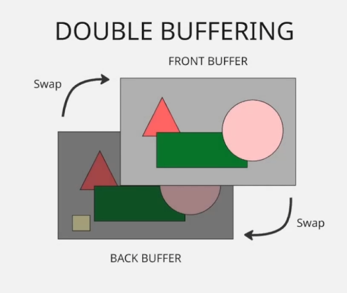
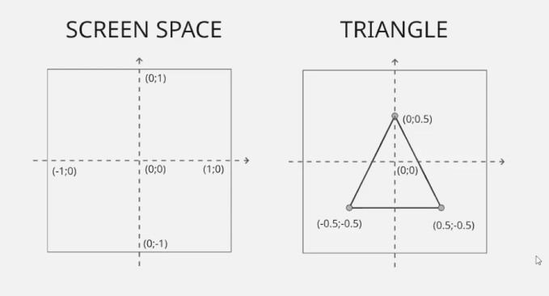
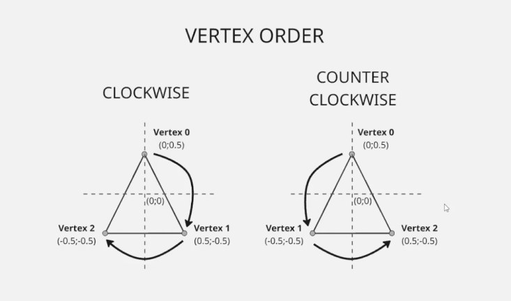
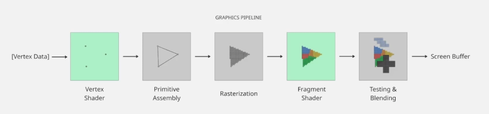
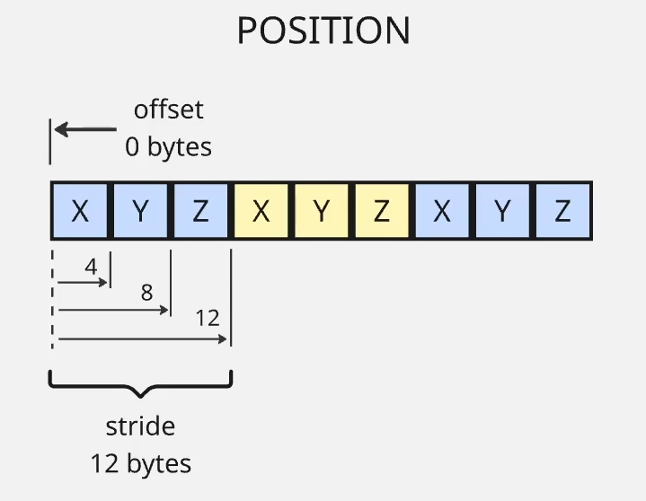

# Section 2 Notes

## 4.1.2 - OpenGL Initialization

In this section we added the `openGL` library to the `main.cpp` file, which is accessed via the `glew` library.

We initialised the `openGL` version to be used then bound the `window` pointer to it.

### Colours

`OpenGL` colours are stored in `4 bytes`, 4 channels containing `1 bytes (8 bits)` each, resulting in `256` values per channel.


We set each channel value using `floats` as these are then converted in the package to `ints`. This apparently is because it's easier for us to think of these values in `OpenGL` as `on or off` values instead. And as OpenGL is a math API and, it's dealing with `blending, interpolation, lighting and shading`; which are all floating-point math.

### Double Buffering

`double-buffering` is a technique used in graphics APIs to stop flickering and visual artifacts during rendering.

All drawing is done on the back buffer, then once everything is ready we swap the buffers.



We do this by running:

```
glfwSwapBuffers(window);
```

## 5.1.3 - Vertices

In this section we added a `vector` data type, which is a sequence container that functions as a `dynamic array`. Vectors act like arrays we'd see in javascript or lists in python, i.e:

* they're `dynamic`
* we can use an `index` to return values
* we can `push values` to them
* we can query they're `size`
* we can check if they're `empty`
* we can `loop` through them
* we can `remove` values from them

### Drawing Vertices

When drawing `vertices` the x, y and z values are represented by a score of `0 to 1`



Graphics APIs can render `vertices` either `clockwise` or `counter-clockwise`. OpenGL uses counter-clockwise by default.




## 6.1.4 - Graphics Pipeline

In order for vertex data to be rendered on screen, it needs to pass through the `graphics pipeline`. These are a number of linear stages, some of which are programmable.

* `Vertex shader` – Runs once per vertex. Transforms positions (model → world → clip space) and outputs per-vertex data (normals, UVs, colors).
* `Primitive assembly` – Groups vertices into primitives (triangles, lines, points) based on indices and draw mode.
* `Rasterization` – Converts primitives into fragments (potential pixels) and interpolates per-vertex data across them.
* `Fragment shader` – Runs per fragment. Computes final color (lighting, textures, etc.).
* `Testing and blending` – Depth/stencil tests decide if a fragment is kept; blending mixes it with existing framebuffer data (e.g. transparency).



We have the most control over the `vertex shader` and `fragment shader` stages.

## 7.1.5 - Shaders

In this lesson, we created the vertex and fragment shaders discussed above. What is essentially does is, At runtime, I upload a tiny program (as text) to the GPU driver, which compiles and runs it on massively parallel hardware.

OpenGL was designed to be hardware agnostic, so doesn't do any of the work like loading files etc, we do all that. We then pass that data, which gets compiled into `GPU-specific machine code`, which differs depending on the `GPU` used.

## 8.1.6 - Vertext Buffers and Rendering (First Triangle)

We load our vertices data in GPU data via a `buffer`.

A buffer in C++ is a block of `contiguous memory` used to store data temporarily.

* Usually an array or memory allocation
* Holds raw data (bytes, ints, floats, structs)
* Often passed to APIs, hardware, or other code to read from

For vertices, we create a buffer that'll start in the 0 `offset` position, then have a stride of `12 bytes` per vertices (and x, y and z float).



In our code, we create a `vertex buffer` then populate it with our vertex data. We then pass that `vertex data` to the `shader` and ultimately draw it.